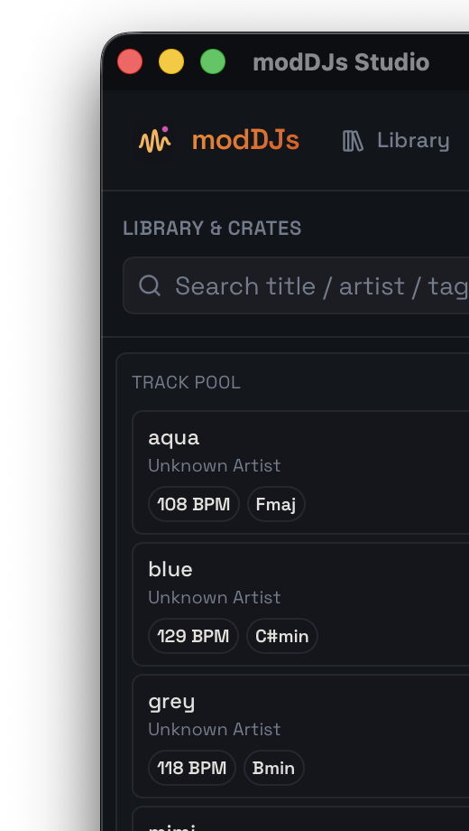
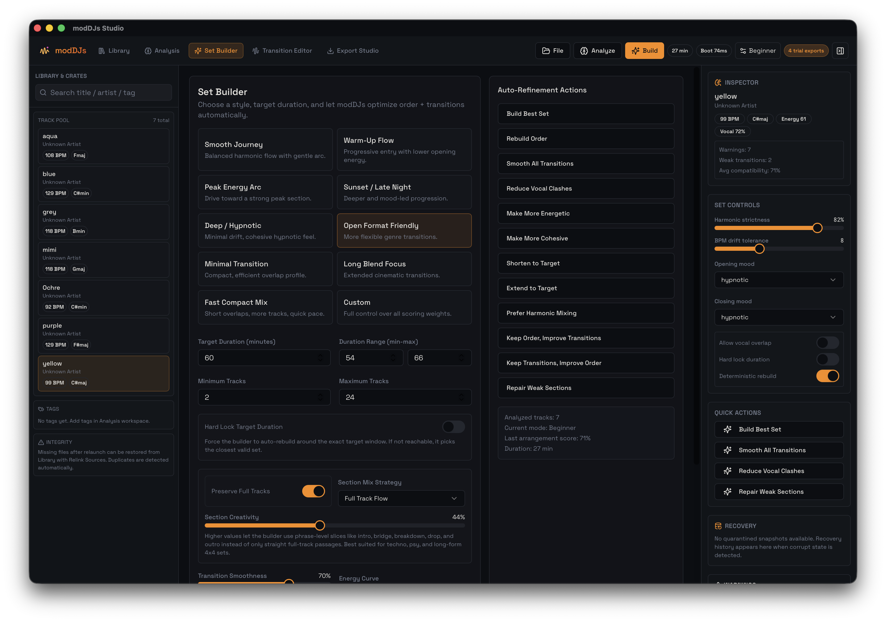
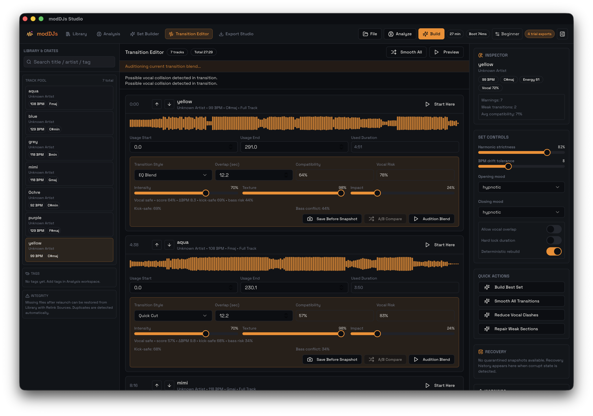
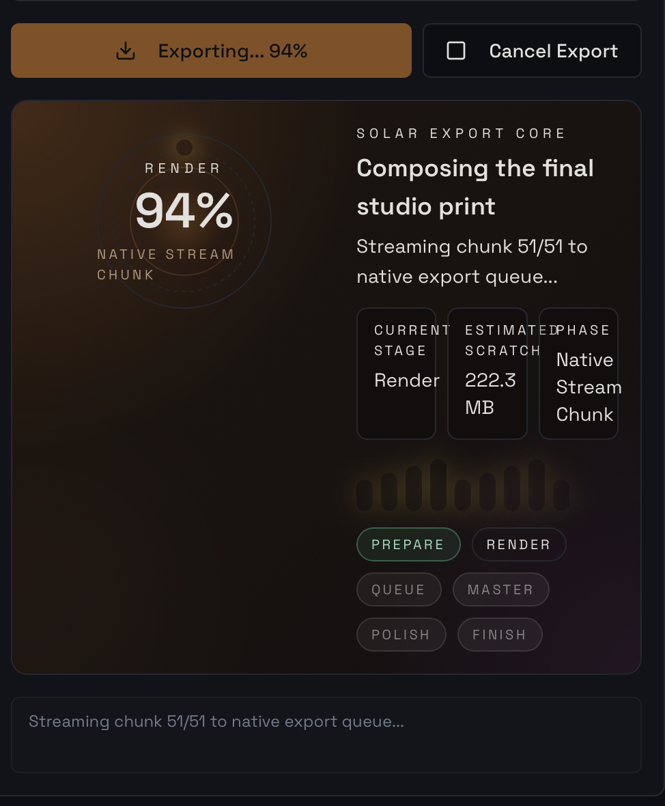

# modDJs Studio

modDJs Studio is a desktop-first mix composition environment for DJs, selectors, and curators who want a finished continuous set without performing it live.

This is not deck software.
No jog wheels.
No fake mixer.
No booth UI.

modDJs is built around a different workflow:

- import a track pool
- analyze BPM, key, phrase structure, energy, vocal density, and texture
- build an ordered set automatically
- weave section recalls and transition handoffs
- refine the arrangement on a timeline
- export one polished continuous mix

## What It Feels Like

modDJs is closer to a composition studio than a performance tool.

It is designed for the moment before publishing:

- planning a serious club set
- shaping a journey for upload
- rebuilding a pool into a more musical order
- turning a collection of tracks into one finished master

The core idea is simple:

You are not "playing" tracks.
You are building a complete set.

## Why It Stands Apart

Most DJ applications assume linear track playback.
modDJs is being built to go beyond that.

In club-focused workflows it can analyze and recombine sections from different sources into one tighter arrangement:

- one minute from the first track
- a short bridge from another
- a later drop relay from a third
- a recall from an earlier source after the energy curve has moved

That only works if the analysis layer is strong enough, so modDJs reads more than surface metadata:

- BPM and key confidence
- phrase and section structure
- tonal lock and harmonic fit
- kick and bassline conflict risk
- vocal density and instrumental space
- spectral texture and timbral motion
- slice-level recall readiness for intro, bridge, drop, breakdown, and outro regions

## Built For

- DJs preparing upload-ready mixes
- techno, house, hypnotic, and long-form selectors
- creators who want fast automation with enough control to refine
- desktop users who want a serious production workflow, not a performance skin

## Product Tour

Documentation site and manual pages:

- `docs/index.html`
- `docs/getting-started.html`
- `docs/workspaces.html`
- `docs/analysis-manual.html`
- `docs/transition-editor-manual.html`
- `docs/export-studio-manual.html`
- `docs/licensing.html`

All screenshots below are captured from the actual modDJs Studio application interface.

### 1. Track Pool And Builder Shell

The left track pool and builder shell are where the project starts.
This is the part of the app that keeps the set grounded in real sources before arrangement and export decisions take over.

What this area is for:

- drag-and-drop import
- crate-style pool management
- duplicate handling
- relink support for moved files
- duration targeting and preset selection
- one-click rebuild actions once the pool is ready

Why it matters:
It keeps modDJs focused on project-based set construction instead of a temporary playlist mentality.

### 2. Transition Editor

The Transition Editor is where the set stops feeling like a simple sequence and starts feeling arranged.

What this workspace is for:

- slice-aware placements
- overlap shaping
- transition style selection
- compatibility inspection
- recall section placement
- transition audition and A/B workflow

Why it matters:
This is where modDJs becomes different from software that only crossfades full tracks in order.

### 3. Export Studio

Export Studio is the final production pass.

What this workspace is for:

- mastering-aware export controls
- phase-by-phase export visibility
- native ffmpeg export pipeline
- compare before and after master
- export history and output reveal

The export stage is designed to feel like the final print step of a studio tool, not a rough bounce.
It is the point where timeline logic, mastering choices, and delivery settings become one controlled final print.

## Core Strengths

- smart ordering instead of manual deck juggling
- section weaving instead of rigid full-track sequencing
- phrase-aware transitions instead of blind crossfades
- duration targeting instead of guesswork
- mastering-aware export instead of rough bounce workflows
- desktop-native packaging for Apple Silicon and Windows

## Workflow In Practice

1. Import a track pool.
2. Run analysis.
3. Set a target duration and mix profile.
4. Let modDJs build the strongest arrangement it can.
5. Review transitions and recall slices.
6. Export one finished set.

## Platforms

- macOS Apple Silicon first
- macOS Intel validation in release gate
- Windows installer pipeline
- GitHub Releases distribution for desktop binaries

## Trial And Activation

modDJs currently uses a simple desktop license model:

- trial: **5 full set exports**
- activation: one-time desktop license
- current reference price: **$99**

Activation channels currently prepared:

- BNB wallet: `0xc66aC8bcF729a6398bc879B7454B13983220601e`
- IBAN support contact: `studiobrn@gmail.com`

The long-term direction is device-bound activation with signed tokens and verified payment intents, so trial usage, activation, and future revalidation stay predictable.

## Public Repository Policy

This public repository is intended to stay source-free.

It should contain only:

- `README.md`
- `screenshots/`
- `docs/`
- release assets published through GitHub Releases

Important:
If the development repository is made public, all branches and tags become public too.
That means the safe release model is:

1. keep the full source repository private
2. publish a separate public repo or a dedicated docs-only public surface
3. ship binaries via Releases

## Release Checklist

Release publishing stays blocked until the gate is green:

- Apple Silicon smoke
- mac Intel smoke
- Windows smoke
- 10 / 30 / 60 minute export benchmarks
- low disk preflight
- missing file relink smoke

## Releases

Desktop binaries will be published in GitHub Releases.

The public repository surface exists to explain the product, show the workflow, and host release assets without exposing the development codebase.
